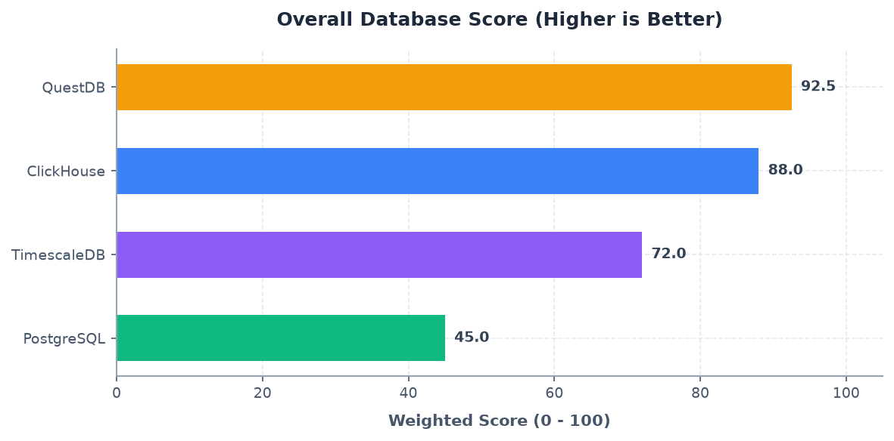
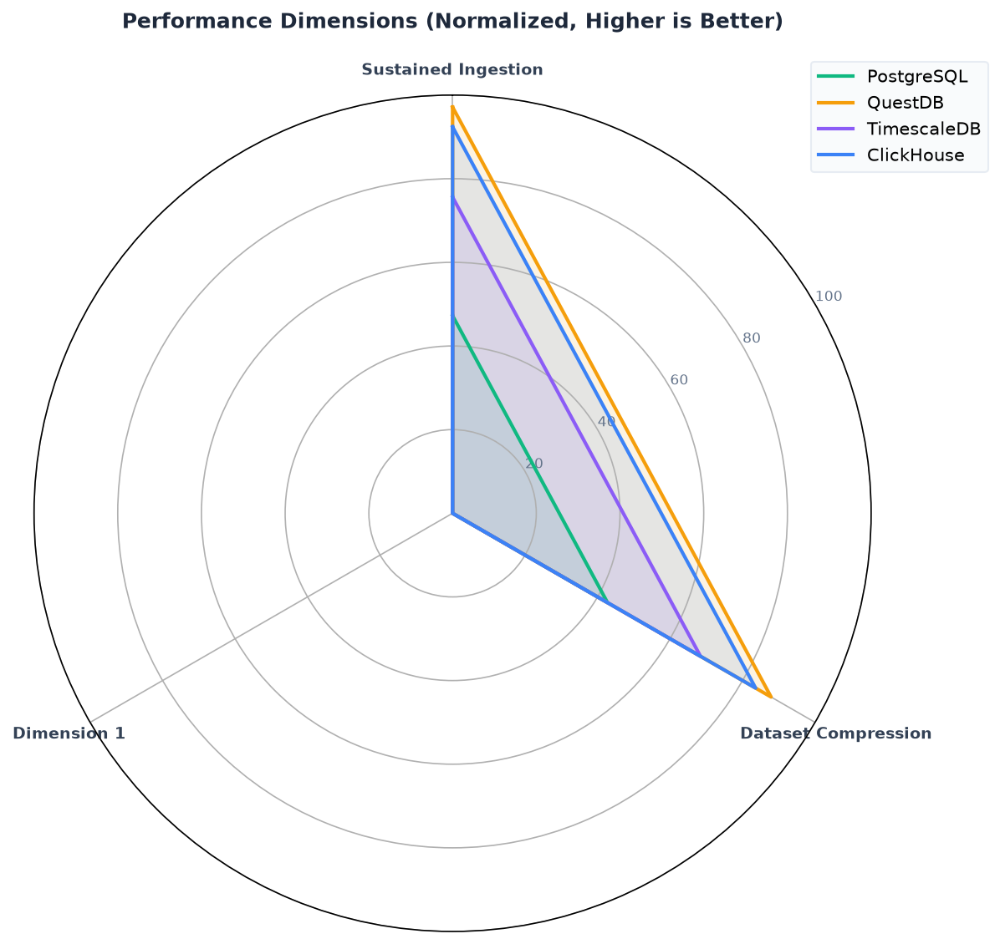
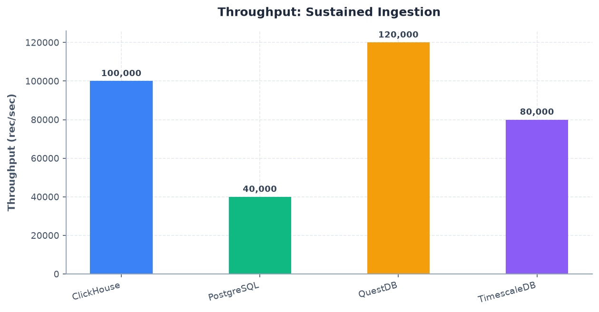
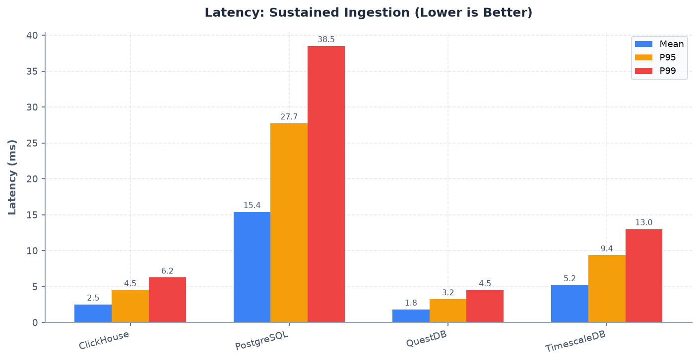
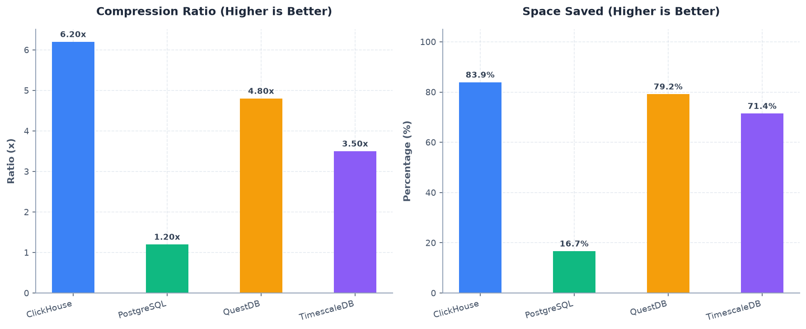
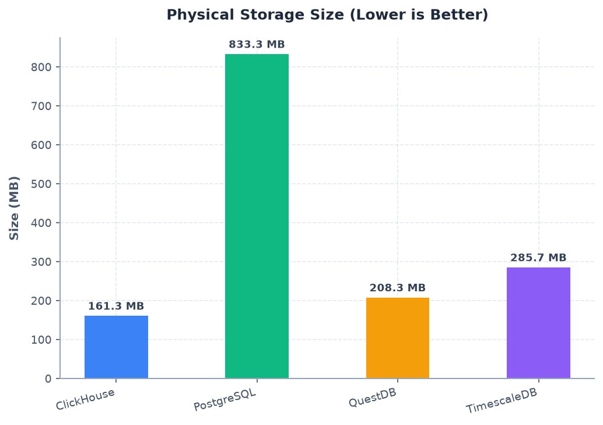

# Drone Storage Bench - Evaluation Report

Comparative summary of time-series database benchmark workloads.

| Database | Scenario | Scenario Type | Success | Duration (s) | Error Details / Metrics Summary |
| --- | --- | --- | --- | --- | --- |
| PostgreSQL | Sustained Ingestion | write_throughput | ✅ YES | 0.00 | rows_per_second: 40000.0 rec/sec, average_latency_ms: 15.4 ms, p95_latency_ms: 27.720000000000002 ms, p99_latency_ms: 38.5 ms |
| QuestDB | Sustained Ingestion | write_throughput | ✅ YES | 0.00 | rows_per_second: 120000.0 rec/sec, average_latency_ms: 1.8 ms, p95_latency_ms: 3.24 ms, p99_latency_ms: 4.5 ms |
| TimescaleDB | Sustained Ingestion | write_throughput | ✅ YES | 0.00 | rows_per_second: 80000.0 rec/sec, average_latency_ms: 5.2 ms, p95_latency_ms: 9.360000000000001 ms, p99_latency_ms: 13.0 ms |
| ClickHouse | Sustained Ingestion | write_throughput | ✅ YES | 0.00 | rows_per_second: 100000.0 rec/sec, average_latency_ms: 2.5 ms, p95_latency_ms: 4.5 ms, p99_latency_ms: 6.25 ms |
| PostgreSQL | Dataset Compression | compression_evaluation | ✅ YES | 0.00 | compression_ratio: 1.2 count, compression_percentage: 16.666666666666664 percent, physical_storage_size_bytes: 833333333.3333334 bytes |
| QuestDB | Dataset Compression | compression_evaluation | ✅ YES | 0.00 | compression_ratio: 4.8 count, compression_percentage: 79.16666666666666 percent, physical_storage_size_bytes: 208333333.33333334 bytes |
| TimescaleDB | Dataset Compression | compression_evaluation | ✅ YES | 0.00 | compression_ratio: 3.5 count, compression_percentage: 71.42857142857143 percent, physical_storage_size_bytes: 285714285.71428573 bytes |
| ClickHouse | Dataset Compression | compression_evaluation | ✅ YES | 0.00 | compression_ratio: 6.2 count, compression_percentage: 83.87096774193549 percent, physical_storage_size_bytes: 161290322.58064514 bytes |

## Performance Rankings and Scores

| Rank | Database | Overall Score | Scenario Scores (Scenario: Raw -> Weighted) |
| --- | --- | --- | --- |
| 4 | PostgreSQL | 45.00 | Sustained Ingestion: 120000.00 -> 9.00, Dataset Compression: 5.00 -> 6.75 |
| 1 | QuestDB | 92.50 | Sustained Ingestion: 120000.00 -> 18.50, Dataset Compression: 5.00 -> 13.88 |
| 3 | TimescaleDB | 72.00 | Sustained Ingestion: 120000.00 -> 14.40, Dataset Compression: 5.00 -> 10.80 |
| 2 | ClickHouse | 88.00 | Sustained Ingestion: 120000.00 -> 17.60, Dataset Compression: 5.00 -> 13.20 |

## Performance Visualizations

### Overall Performance Scores

### Multi-Dimensional Comparison (Radar Chart)

### Throughput & Latency Analysis

### Storage & Compression Efficiency

