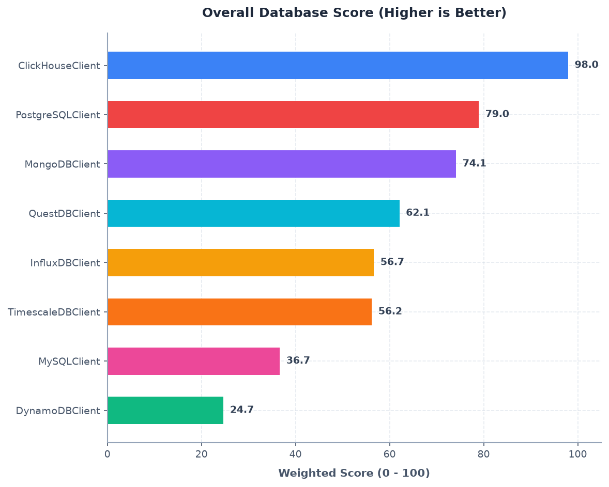
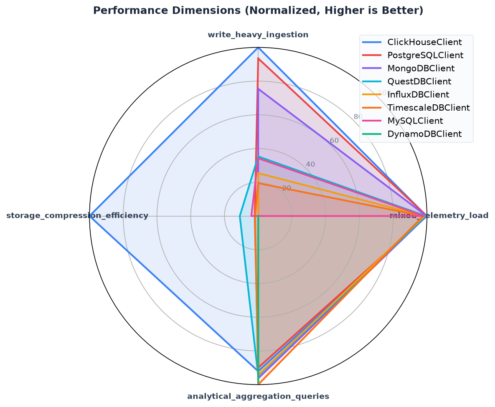
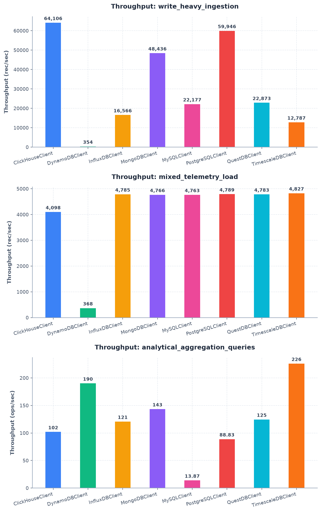
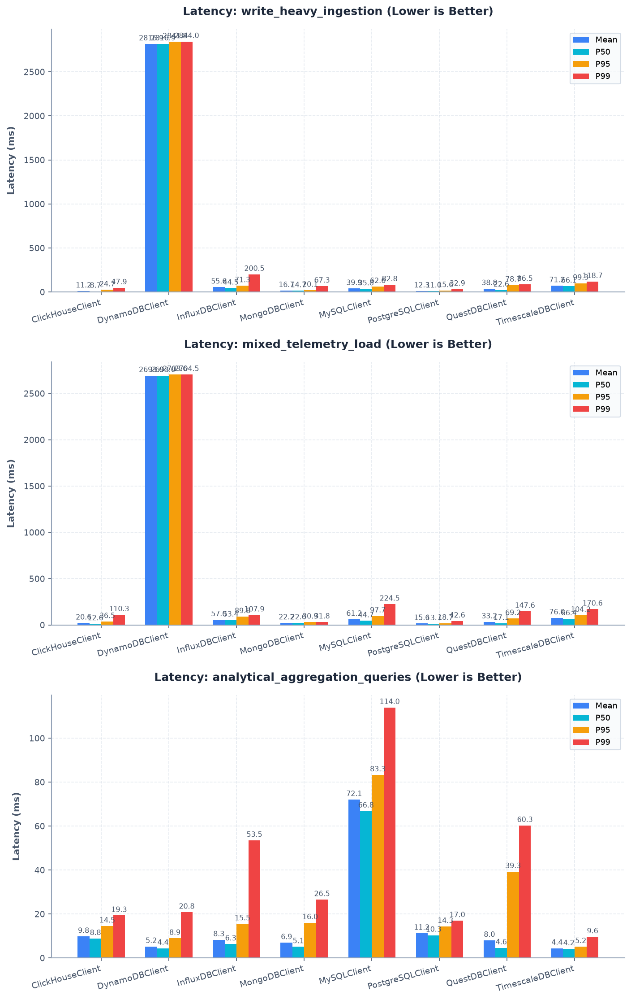
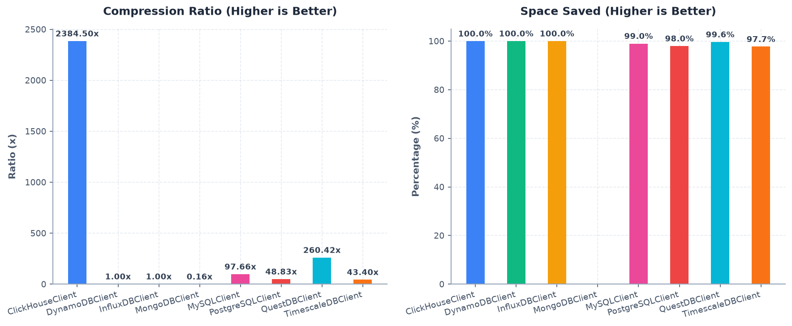
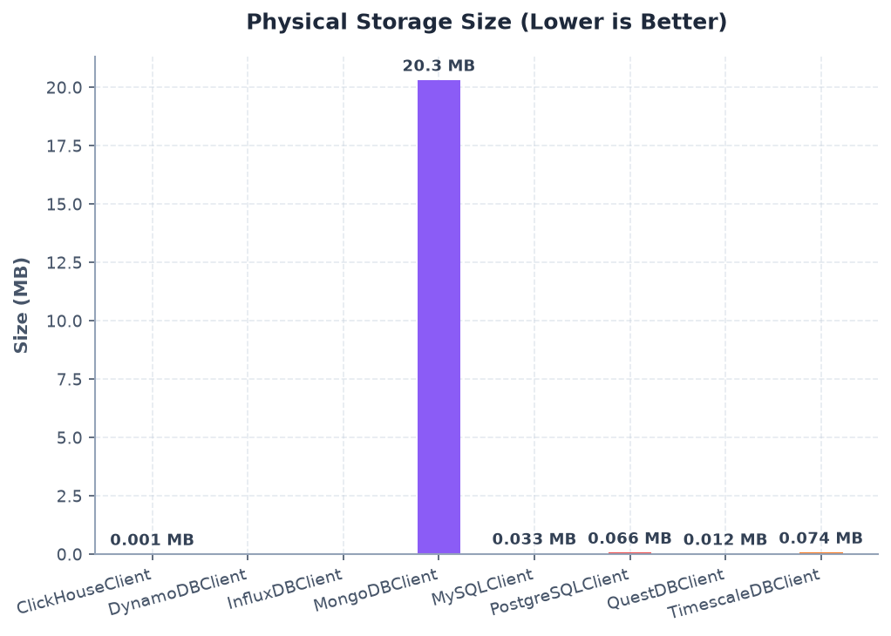

# Drone Storage Bench - Evaluation Report

Comparative summary of time-series database benchmark workloads.

| Database | Scenario | Scenario Type | Success | Duration (s) | Error Details / Metrics Summary |
| --- | --- | --- | --- | --- | --- |
| PostgreSQLClient | write_heavy_ingestion | write_throughput | ✅ YES | 1.25 | total_rows_written: 75000.0 count, successful_batches: 75.0 count, failed_batches: 0.0 count, total_duration_seconds: 1.25113020799472 sec, rows_per_second: 59945.7990229555 rec/sec, average_batch_latency_ms: 12.336540029306585 ms, p50_batch_latency_ms: 11.029332992620766 ms, p95_batch_latency_ms: 15.597278907080177 ms, p99_batch_latency_ms: 32.88325106492289 ms, write_throughput: 59945.7990229555 rec/sec, write_latency_mean: 12.336540029306585 ms, write_latency_p95: 15.597278907080177 ms, write_latency_p99: 32.88325106492289 ms |
| MySQLClient | write_heavy_ingestion | write_throughput | ✅ YES | 3.38 | total_rows_written: 75000.0 count, successful_batches: 75.0 count, failed_batches: 0.0 count, total_duration_seconds: 3.381871207995573 sec, rows_per_second: 22177.07162315395 rec/sec, average_batch_latency_ms: 39.89393441355787 ms, p50_batch_latency_ms: 35.7521660043858 ms, p95_batch_latency_ms: 62.59326250583398 ms, p99_batch_latency_ms: 82.79500106873479 ms, write_throughput: 22177.07162315395 rec/sec, write_latency_mean: 39.89393441355787 ms, write_latency_p95: 62.59326250583398 ms, write_latency_p99: 82.79500106873479 ms |
| TimescaleDBClient | write_heavy_ingestion | write_throughput | ✅ YES | 5.00 | total_rows_written: 64000.0 count, successful_batches: 64.0 count, failed_batches: 0.0 count, total_duration_seconds: 5.005075791006675 sec, rows_per_second: 12787.019152636572 rec/sec, average_batch_latency_ms: 71.19066660834505 ms, p50_batch_latency_ms: 66.1013329954585 ms, p95_batch_latency_ms: 99.25160804850742 ms, p99_batch_latency_ms: 118.69011800736186 ms, write_throughput: 12787.019152636572 rec/sec, write_latency_mean: 71.19066660834505 ms, write_latency_p95: 99.25160804850742 ms, write_latency_p99: 118.69011800736186 ms |
| QuestDBClient | write_heavy_ingestion | write_throughput | ✅ YES | 3.28 | total_rows_written: 75000.0 count, successful_batches: 75.0 count, failed_batches: 0.0 count, total_duration_seconds: 3.2789425419759937 sec, rows_per_second: 22873.227889746016 rec/sec, average_batch_latency_ms: 38.7680561223533 ms, p50_batch_latency_ms: 22.555125004146248 ms, p95_batch_latency_ms: 78.7192748801317 ms, p99_batch_latency_ms: 86.46572108555122 ms, write_throughput: 22873.227889746016 rec/sec, write_latency_mean: 38.7680561223533 ms, write_latency_p95: 78.7192748801317 ms, write_latency_p99: 86.46572108555122 ms |
| ClickHouseClient | write_heavy_ingestion | write_throughput | ✅ YES | 1.17 | total_rows_written: 75000.0 count, successful_batches: 75.0 count, failed_batches: 0.0 count, total_duration_seconds: 1.1699402079975698 sec, rows_per_second: 64105.8401850873 rec/sec, average_batch_latency_ms: 11.229842733591795 ms, p50_batch_latency_ms: 8.70241699158214 ms, p95_batch_latency_ms: 24.727945384802258 ms, p99_batch_latency_ms: 47.885278573376176 ms, write_throughput: 64105.8401850873 rec/sec, write_latency_mean: 11.229842733591795 ms, write_latency_p95: 24.727945384802258 ms, write_latency_p99: 47.885278573376176 ms |
| InfluxDBClient | write_heavy_ingestion | write_throughput | ✅ YES | 4.53 | total_rows_written: 75000.0 count, successful_batches: 75.0 count, failed_batches: 0.0 count, total_duration_seconds: 4.527343958005076 sec, rows_per_second: 16566.0044157652 rec/sec, average_batch_latency_ms: 55.6428044118608 ms, p50_batch_latency_ms: 44.51416598749347 ms, p95_batch_latency_ms: 71.31497928639874 ms, p99_batch_latency_ms: 200.5382640898481 ms, write_throughput: 16566.0044157652 rec/sec, write_latency_mean: 55.6428044118608 ms, write_latency_p95: 71.31497928639874 ms, write_latency_p99: 200.5382640898481 ms |
| MongoDBClient | write_heavy_ingestion | write_throughput | ✅ YES | 1.55 | total_rows_written: 75000.0 count, successful_batches: 75.0 count, failed_batches: 0.0 count, total_duration_seconds: 1.5484310000028927 sec, rows_per_second: 48436.12663390225 rec/sec, average_batch_latency_ms: 16.741760628841195 ms, p50_batch_latency_ms: 14.705667010275647 ms, p95_batch_latency_ms: 20.129642102983773 ms, p99_batch_latency_ms: 67.26078034902483 ms, write_throughput: 48436.12663390225 rec/sec, write_latency_mean: 16.741760628841195 ms, write_latency_p95: 20.129642102983773 ms, write_latency_p99: 67.26078034902483 ms |
| DynamoDBClient | write_heavy_ingestion | write_throughput | ✅ YES | 5.64 | total_rows_written: 2000.0 count, successful_batches: 2.0 count, failed_batches: 0.0 count, total_duration_seconds: 5.643876874994021 sec, rows_per_second: 354.36634148793667 rec/sec, average_batch_latency_ms: 2816.922062993399 ms, p50_batch_latency_ms: 2816.922062993399 ms, p95_batch_latency_ms: 2841.7858193904976 ms, p99_batch_latency_ms: 2843.9959310702397 ms, write_throughput: 354.36634148793667 rec/sec, write_latency_mean: 2816.922062993399 ms, write_latency_p95: 2841.7858193904976 ms, write_latency_p99: 2843.9959310702397 ms |
| PostgreSQLClient | mixed_telemetry_load | burst_write_latency | ✅ YES | 5.22 | total_rows_written: 25000.0 count, successful_batches: 25.0 count, failed_batches: 0.0 count, total_duration_seconds: 5.220209999999497 sec, average_batch_latency_ms: 15.605635041138157 ms, average_latency_ms: 15.605635041138157 ms, p50_batch_latency_ms: 13.692374981474131 ms, p95_batch_latency_ms: 18.65688339457847 ms, p99_batch_latency_ms: 42.621958840172674 ms, maximum_batch_latency_ms: 50.10595900239423 ms, throughput_during_burst: 4858.485675563878 rec/sec, throughput_outside_burst: 4850.790430161709 rec/sec, read_throughput: 14.175674924956493 rec/sec, read_latency_mean: 19.04097469043729 ms, read_latency_p95: 23.21647775388555 ms, read_latency_p99: 43.304648742195965 ms, write_throughput: 4789.079366539356 rec/sec, write_latency_mean: 15.605635041138157 ms, write_latency_p95: 18.65688339457847 ms, write_latency_p99: 42.621958840172674 ms |
| MySQLClient | mixed_telemetry_load | burst_write_latency | ✅ YES | 5.04 | total_rows_written: 24000.0 count, successful_batches: 24.0 count, failed_batches: 0.0 count, total_duration_seconds: 5.038353874988388 sec, average_batch_latency_ms: 61.200894123127604 ms, average_latency_ms: 61.200894123127604 ms, p50_batch_latency_ms: 44.68893750163261 ms, p95_batch_latency_ms: 97.65722684969658 ms, p99_batch_latency_ms: 224.48786299297348 ms, maximum_batch_latency_ms: 262.2369579912629 ms, throughput_during_burst: 4682.570954650461 rec/sec, throughput_outside_burst: 4861.102949940285 rec/sec, read_throughput: 6.152803230811461 rec/sec, read_latency_mean: 108.0306317439423 ms, read_latency_p95: 234.4409369979985 ms, read_latency_p99: 319.5675954018951 ms, write_throughput: 4763.460565789518 rec/sec, write_latency_mean: 61.200894123127604 ms, write_latency_p95: 97.65722684969658 ms, write_latency_p99: 224.48786299297348 ms |
| TimescaleDBClient | mixed_telemetry_load | burst_write_latency | ✅ YES | 5.18 | total_rows_written: 25000.0 count, successful_batches: 25.0 count, failed_batches: 0.0 count, total_duration_seconds: 5.178760749986395 sec, average_batch_latency_ms: 75.99089500145055 ms, average_latency_ms: 75.99089500145055 ms, p50_batch_latency_ms: 66.41104200389236 ms, p95_batch_latency_ms: 104.19264980009751 ms, p99_batch_latency_ms: 170.56060299859365 ms, maximum_batch_latency_ms: 190.3085829981137 ms, throughput_during_burst: 4872.633516460556 rec/sec, throughput_outside_burst: 4883.595833844747 rec/sec, read_throughput: 15.061518337220908 rec/sec, read_latency_mean: 15.348639907852675 ms, read_latency_p95: 19.421965151559554 ms, read_latency_p99: 62.29231158038627 ms, write_throughput: 4827.40972346824 rec/sec, write_latency_mean: 75.99089500145055 ms, write_latency_p95: 104.19264980009751 ms, write_latency_p99: 170.56060299859365 ms |
| QuestDBClient | mixed_telemetry_load | burst_write_latency | ✅ YES | 5.23 | total_rows_written: 25000.0 count, successful_batches: 25.0 count, failed_batches: 0.0 count, total_duration_seconds: 5.226812582986895 sec, average_batch_latency_ms: 33.22073159739375 ms, average_latency_ms: 33.22073159739375 ms, p50_batch_latency_ms: 17.128082981798798 ms, p95_batch_latency_ms: 69.20380798401311 ms, p99_batch_latency_ms: 147.59466107701863 ms, maximum_batch_latency_ms: 172.25279100239277 ms, throughput_during_burst: 4869.692905285503 rec/sec, throughput_outside_burst: 4819.929760002364 rec/sec, read_throughput: 10.90530779418668 rec/sec, read_latency_mean: 39.248660035745914 ms, read_latency_p95: 78.09105000342237 ms, read_latency_p99: 135.97281296038983 ms, write_throughput: 4783.029734292403 rec/sec, write_latency_mean: 33.22073159739375 ms, write_latency_p95: 69.20380798401311 ms, write_latency_p99: 147.59466107701863 ms |
| ClickHouseClient | mixed_telemetry_load | burst_write_latency | ✅ YES | 5.12 | total_rows_written: 21000.0 count, successful_batches: 21.0 count, failed_batches: 1.0 count, total_duration_seconds: 5.124153958022362 sec, average_batch_latency_ms: 20.59317054623865 ms, average_latency_ms: 20.59317054623865 ms, p50_batch_latency_ms: 12.622916503460146 ms, p95_batch_latency_ms: 36.530638157273636 ms, p99_batch_latency_ms: 110.33029014331979 ms, maximum_batch_latency_ms: 129.8850000021048 ms, throughput_during_burst: 4026.5294589684277 rec/sec, throughput_outside_burst: 4834.267150726395 rec/sec, read_throughput: 11.904404219646555 rec/sec, read_latency_mean: 28.67609970500601 ms, read_latency_p95: 48.755249998066574 ms, read_latency_p99: 223.68331699981312 ms, write_throughput: 4098.237518238978 rec/sec, write_latency_mean: 20.59317054623865 ms, write_latency_p95: 36.530638157273636 ms, write_latency_p99: 110.33029014331979 ms |
| InfluxDBClient | mixed_telemetry_load | burst_write_latency | ✅ YES | 5.22 | total_rows_written: 25000.0 count, successful_batches: 25.0 count, failed_batches: 0.0 count, total_duration_seconds: 5.224430041998858 sec, average_batch_latency_ms: 56.9637918821536 ms, average_latency_ms: 56.9637918821536 ms, p50_batch_latency_ms: 53.35658401600085 ms, p95_batch_latency_ms: 89.84928399440824 ms, p99_batch_latency_ms: 107.87076708511447 ms, maximum_batch_latency_ms: 111.68891700799577 ms, throughput_during_burst: 4862.444004751764 rec/sec, throughput_outside_burst: 4855.966049880868 rec/sec, read_throughput: 14.929858256874532 rec/sec, read_latency_mean: 13.36065807808131 ms, read_latency_p95: 32.06927490391535 ms, read_latency_p99: 41.16842323244793 ms, write_throughput: 4785.210979767478 rec/sec, write_latency_mean: 56.9637918821536 ms, write_latency_p95: 89.84928399440824 ms, write_latency_p99: 107.87076708511447 ms |
| MongoDBClient | mixed_telemetry_load | burst_write_latency | ✅ YES | 5.04 | total_rows_written: 24000.0 count, successful_batches: 24.0 count, failed_batches: 0.0 count, total_duration_seconds: 5.035863708006218 sec, average_batch_latency_ms: 22.166944415706286 ms, average_latency_ms: 22.166944415706286 ms, p50_batch_latency_ms: 22.616916001425125 ms, p95_batch_latency_ms: 30.853634906816293 ms, p99_batch_latency_ms: 31.75091582670575 ms, maximum_batch_latency_ms: 31.976957980077714 ms, throughput_during_burst: 4852.4717146582225 rec/sec, throughput_outside_burst: 4834.620862039116 rec/sec, read_throughput: 14.694599435316693 rec/sec, read_latency_mean: 16.499632888479862 ms, read_latency_p95: 24.079020945646313 ms, read_latency_p99: 52.97604676103187 ms, write_throughput: 4765.816033075685 rec/sec, write_latency_mean: 22.166944415706286 ms, write_latency_p95: 30.853634906816293 ms, write_latency_p99: 31.75091582670575 ms |
| DynamoDBClient | mixed_telemetry_load | burst_write_latency | ✅ YES | 5.43 | total_rows_written: 2000.0 count, successful_batches: 2.0 count, failed_batches: 0.0 count, total_duration_seconds: 5.435009458014974 sec, average_batch_latency_ms: 2693.015583019587 ms, average_latency_ms: 2693.015583019587 ms, p50_batch_latency_ms: 2693.015583019587 ms, p95_batch_latency_ms: 2703.594370216888 ms, p99_batch_latency_ms: 2704.534706856648 ms, maximum_batch_latency_ms: 2704.769791016588 ms, throughput_during_burst: 372.34092153762 rec/sec, throughput_outside_burst: 369.08878924506337 rec/sec, read_throughput: 16.37531648979051 rec/sec, read_latency_mean: 9.518518774139727 ms, read_latency_p95: 15.407908597262573 ms, read_latency_p99: 26.539438081672472 ms, write_throughput: 367.9846402200115 rec/sec, write_latency_mean: 2693.015583019587 ms, write_latency_p95: 2703.594370216888 ms, write_latency_p99: 2704.534706856648 ms |
| PostgreSQLClient | analytical_aggregation_queries | time_range_queries | ✅ YES | 1.13 | total_queries: 100.0 count, successful_queries: 100.0 count, failed_queries: 0.0 count, total_duration_seconds: 1.125762667012168 sec, average_latency_ms: 11.23243249981897 ms, p50_latency_ms: 10.322354501113296 ms, p95_latency_ms: 14.339130610460415 ms, p99_latency_ms: 16.9651293518838 ms, maximum_latency_ms: 44.000875001074746 ms, rows_returned_average: 252.0 count, rows_returned_maximum: 252.0 count, read_throughput: 88.82866960351878 ops/sec, read_latency_mean: 11.23243249981897 ms, read_latency_p95: 14.339130610460415 ms, read_latency_p99: 16.9651293518838 ms |
| MySQLClient | analytical_aggregation_queries | time_range_queries | ✅ YES | 7.21 | total_queries: 100.0 count, successful_queries: 100.0 count, failed_queries: 0.0 count, total_duration_seconds: 7.211059166002087 sec, average_latency_ms: 72.08465372008504 ms, p50_latency_ms: 66.84910449257586 ms, p95_latency_ms: 83.28739584831055 ms, p99_latency_ms: 113.97968323464875 ms, maximum_latency_ms: 376.88816600712016 ms, rows_returned_average: 252.0 count, rows_returned_maximum: 252.0 count, read_throughput: 13.867588338682486 ops/sec, read_latency_mean: 72.08465372008504 ms, read_latency_p95: 83.28739584831055 ms, read_latency_p99: 113.97968323464875 ms |
| TimescaleDBClient | analytical_aggregation_queries | time_range_queries | ✅ YES | 0.44 | total_queries: 100.0 count, successful_queries: 100.0 count, failed_queries: 0.0 count, total_duration_seconds: 0.4426256659789942 sec, average_latency_ms: 4.41388249018928 ms, p50_latency_ms: 4.175374997430481 ms, p95_latency_ms: 5.158039915841072 ms, p99_latency_ms: 9.618501345685223 ms, maximum_latency_ms: 10.786041006213054 ms, rows_returned_average: 252.0 count, rows_returned_maximum: 252.0 count, read_throughput: 225.92454004857848 ops/sec, read_latency_mean: 4.41388249018928 ms, read_latency_p95: 5.158039915841072 ms, read_latency_p99: 9.618501345685223 ms |
| QuestDBClient | analytical_aggregation_queries | time_range_queries | ✅ YES | 0.80 | total_queries: 100.0 count, successful_queries: 100.0 count, failed_queries: 0.0 count, total_duration_seconds: 0.8030170839920174 sec, average_latency_ms: 8.007940428215079 ms, p50_latency_ms: 4.5923124853288755 ms, p95_latency_ms: 39.28547320247158 ms, p99_latency_ms: 60.27159267163372 ms, maximum_latency_ms: 63.35808298899792 ms, rows_returned_average: 252.0 count, rows_returned_maximum: 252.0 count, read_throughput: 124.5303518361934 ops/sec, read_latency_mean: 8.007940428215079 ms, read_latency_p95: 39.28547320247158 ms, read_latency_p99: 60.27159267163372 ms |
| ClickHouseClient | analytical_aggregation_queries | time_range_queries | ✅ YES | 0.98 | total_queries: 100.0 count, successful_queries: 100.0 count, failed_queries: 0.0 count, total_duration_seconds: 0.9811728750064503 sec, average_latency_ms: 9.78377822902985 ms, p50_latency_ms: 8.827249999740161 ms, p95_latency_ms: 14.493306555959858 ms, p99_latency_ms: 19.330038337793756 ms, maximum_latency_ms: 36.7702080111485 ms, rows_returned_average: 251.0 count, rows_returned_maximum: 251.0 count, read_throughput: 101.91883871569787 ops/sec, read_latency_mean: 9.78377822902985 ms, read_latency_p95: 14.493306555959858 ms, read_latency_p99: 19.330038337793756 ms |
| InfluxDBClient | analytical_aggregation_queries | time_range_queries | ✅ YES | 0.83 | total_queries: 100.0 count, successful_queries: 100.0 count, failed_queries: 0.0 count, total_duration_seconds: 0.8285743329906836 sec, average_latency_ms: 8.261149237805512 ms, p50_latency_ms: 6.331395998131484 ms, p95_latency_ms: 15.51363749458687 ms, p99_latency_ms: 53.5093529109145 ms, maximum_latency_ms: 61.10541700036265 ms, rows_returned_average: 250.0 count, rows_returned_maximum: 250.0 count, read_throughput: 120.68923211639527 ops/sec, read_latency_mean: 8.261149237805512 ms, read_latency_p95: 15.51363749458687 ms, read_latency_p99: 53.5093529109145 ms |
| MongoDBClient | analytical_aggregation_queries | time_range_queries | ✅ YES | 0.70 | total_queries: 100.0 count, successful_queries: 100.0 count, failed_queries: 0.0 count, total_duration_seconds: 0.6973514999845065 sec, average_latency_ms: 6.944808769912925 ms, p50_latency_ms: 5.1016044890275225 ms, p95_latency_ms: 16.011610698478762 ms, p99_latency_ms: 26.537274913571316 ms, maximum_latency_ms: 27.95870800036937 ms, rows_returned_average: 252.0 count, rows_returned_maximum: 252.0 count, read_throughput: 143.3997058903892 ops/sec, read_latency_mean: 6.944808769912925 ms, read_latency_p95: 16.011610698478762 ms, read_latency_p99: 26.537274913571316 ms |
| DynamoDBClient | analytical_aggregation_queries | time_range_queries | ✅ YES | 0.53 | total_queries: 100.0 count, successful_queries: 100.0 count, failed_queries: 0.0 count, total_duration_seconds: 0.5258537500048988 sec, average_latency_ms: 5.240477558691055 ms, p50_latency_ms: 4.4135420030215755 ms, p95_latency_ms: 8.925537795585115 ms, p99_latency_ms: 20.814413413172627 ms, maximum_latency_ms: 28.408249985659495 ms, rows_returned_average: 21.0 count, rows_returned_maximum: 21.0 count, read_throughput: 190.16694280314331 ops/sec, read_latency_mean: 5.240477558691055 ms, read_latency_p95: 8.925537795585115 ms, read_latency_p99: 20.814413413172627 ms |
| PostgreSQLClient | storage_compression_efficiency | compression_evaluation | ✅ YES | 0.01 | logical_dataset_size_bytes: 3200000.0 count, physical_storage_size_bytes: 65536.0 count, compression_ratio: 48.828125 count, compression_percentage: 97.952 count, compression_duration_ms: 0.14112499775364995 ms, total_duration_seconds: 0.013137374975485727 sec |
| MySQLClient | storage_compression_efficiency | compression_evaluation | ✅ YES | 0.14 | logical_dataset_size_bytes: 3200000.0 count, physical_storage_size_bytes: 32768.0 count, compression_ratio: 97.65625 count, compression_percentage: 98.976 count, compression_duration_ms: 0.10066601680591702 ms, total_duration_seconds: 0.1420844579988625 sec |
| TimescaleDBClient | storage_compression_efficiency | compression_evaluation | ✅ YES | 0.07 | logical_dataset_size_bytes: 3200000.0 count, physical_storage_size_bytes: 73728.0 count, compression_ratio: 43.40277777777778 count, compression_percentage: 97.696 count, compression_duration_ms: 0.08229201193898916 ms, total_duration_seconds: 0.0712245000177063 sec |
| QuestDBClient | storage_compression_efficiency | compression_evaluation | ✅ YES | 0.21 | logical_dataset_size_bytes: 3200000.0 count, physical_storage_size_bytes: 12288.0 count, compression_ratio: 260.4166666666667 count, compression_percentage: 99.616 count, compression_duration_ms: 0.07591699250042439 ms, total_duration_seconds: 0.20902349997777492 sec |
| ClickHouseClient | storage_compression_efficiency | compression_evaluation | ✅ YES | 0.03 | logical_dataset_size_bytes: 3200000.0 count, physical_storage_size_bytes: 1342.0 count, compression_ratio: 2384.500745156483 count, compression_percentage: 99.9580625 count, compression_duration_ms: 0.043540989281609654 ms, total_duration_seconds: 0.03442420798819512 sec |
| InfluxDBClient | storage_compression_efficiency | compression_evaluation | ✅ YES | 0.04 | logical_dataset_size_bytes: 3200000.0 count, physical_storage_size_bytes: 0.0 count, compression_ratio: 1.0 count, compression_percentage: 100.0 count, compression_duration_ms: 0.07729098433628678 ms, total_duration_seconds: 0.0367969999788329 sec |
| MongoDBClient | storage_compression_efficiency | compression_evaluation | ✅ YES | 0.07 | logical_dataset_size_bytes: 3200000.0 count, physical_storage_size_bytes: 20312064.0 count, compression_ratio: 0.15754184311353095 count, compression_percentage: -534.7520000000001 count, compression_duration_ms: 0.055832992075011134 ms, total_duration_seconds: 0.07020791599643417 sec |
| DynamoDBClient | storage_compression_efficiency | compression_evaluation | ✅ YES | 0.07 | logical_dataset_size_bytes: 3200000.0 count, physical_storage_size_bytes: 0.0 count, compression_ratio: 1.0 count, compression_percentage: 100.0 count, compression_duration_ms: 0.08608298958279192 ms, total_duration_seconds: 0.07072837499435991 sec |

## Performance Rankings and Scores

| Rank | Database | Overall Score | Scenario Scores (Scenario: Raw -> Weighted) |
| --- | --- | --- | --- |
| 1 | ClickHouseClient | 97.97 | write_heavy_ingestion: 64105.84 -> 33.33, mixed_telemetry_load: 20.59 -> 24.95, analytical_aggregation_queries: 9.78 -> 23.02, storage_compression_efficiency: 2384.50 -> 16.67 |
| 2 | PostgreSQLClient | 78.98 | write_heavy_ingestion: 59945.80 -> 31.16, mixed_telemetry_load: 15.61 -> 25.00, analytical_aggregation_queries: 11.23 -> 22.48, storage_compression_efficiency: 48.83 -> 0.34 |
| 3 | MongoDBClient | 74.14 | write_heavy_ingestion: 48436.13 -> 25.14, mixed_telemetry_load: 22.17 -> 24.94, analytical_aggregation_queries: 6.94 -> 24.06, storage_compression_efficiency: 0.16 -> 0.00 |
| 4 | QuestDBClient | 62.10 | write_heavy_ingestion: 22873.23 -> 11.77, mixed_telemetry_load: 33.22 -> 24.84, analytical_aggregation_queries: 8.01 -> 23.67, storage_compression_efficiency: 260.42 -> 1.82 |
| 5 | InfluxDBClient | 56.67 | write_heavy_ingestion: 16566.00 -> 8.48, mixed_telemetry_load: 56.96 -> 24.61, analytical_aggregation_queries: 8.26 -> 23.58, storage_compression_efficiency: 1.00 -> 0.01 |
| 6 | TimescaleDBClient | 56.24 | write_heavy_ingestion: 12787.02 -> 6.50, mixed_telemetry_load: 75.99 -> 24.44, analytical_aggregation_queries: 4.41 -> 25.00, storage_compression_efficiency: 43.40 -> 0.30 |
| 7 | MySQLClient | 36.67 | write_heavy_ingestion: 22177.07 -> 11.41, mixed_telemetry_load: 61.20 -> 24.57, analytical_aggregation_queries: 72.08 -> 0.00, storage_compression_efficiency: 97.66 -> 0.68 |
| 8 | DynamoDBClient | 24.70 | write_heavy_ingestion: 354.37 -> 0.00, mixed_telemetry_load: 2693.02 -> 0.00, analytical_aggregation_queries: 5.24 -> 24.69, storage_compression_efficiency: 1.00 -> 0.01 |

## Performance Visualizations

### Overall Performance Scores

### Multi-Dimensional Comparison (Radar Chart)

### Throughput & Latency Analysis

### Storage & Compression Efficiency

